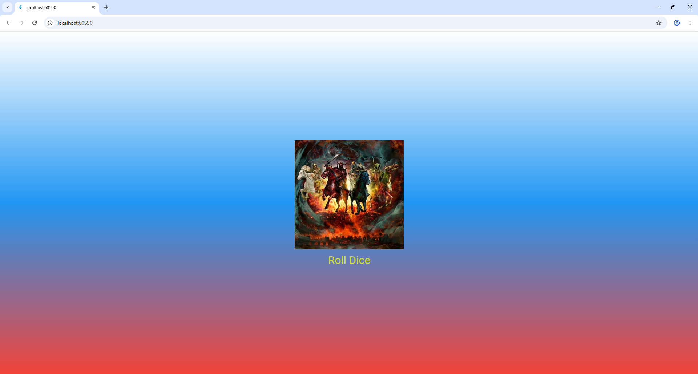

# Лабораторная работа №3. Flutter: структура UI и компонентный подход

**Фамилия, имя:** [Тимонин И.В]  
**Группа:** [ИСП-233]  
**Дата сдачи:** [09.05.2026]

---

## Что изучили
- Построение UI через дерево виджетов Flutter и использование `MaterialApp`, `Scaffold`, `Container`, `Center`, `Column`, `Image` и `TextButton`.
- Создание собственных классов-виджетов, наследуемых от `StatelessWidget` и `StatefulWidget`.
- Генерация случайных чисел и динамическое обновление контента по нажатию кнопки.

---

## Скриншот финального приложения


---

## Ссылка на репозиторий
[Ссылка на GitHub репозиторий](https://github.com/karasidnez/Flutter_Lab3)

---

## Инструкция по запуску
1. Убедитесь, что установлен Flutter SDK и настроена среда.
2. Клонируйте репозиторий:

   ```bash
   git clone https://github.com/karasidnez/Flutter_Lab3
   ```
   
3. Перейдите в папку проекта:

	 ```bash
        cd flutter_lab3_app
         ```
   
4. Получите зависимости:

	```bash
   flutter pub get
   ```
5. Запустите приложение в Chrome
		 ```bash
		   flutter run -d chrome
      ```
## Ответы на вопросы
1)*Зачем выносить виджеты в отдельные файлы? Что изменится если держать всё в main.dart?*

Вынос виджетов в отдельные файлы улучшает организацию кода: каждый виджет отвечает за свою задачу, проект становится проще для навигации и поддержки. Файлы можно переиспользовать в других частях приложения или даже в других проектах. Если всё оставить в main.dart, файл быстро станет перегруженным, трудно читаемым, возрастёт риск конфликтов имён и усложнится командная работа.
2)*Что такое BuildContext? Почему метод build() принимает его как параметр?*

BuildContext — это объект, который определяет положение виджета в дереве виджетов. Он позволяет виджету обращаться к информации, передаваемой сверху по дереву (тема, локализация, MediaQuery, Navigator, InheritedWidget и т.д.). Метод build() получает context, чтобы виджет мог правильно взаимодействовать с окружающими элементами и подстраивать свой внешний вид.
3)*Чем StatelessWidget отличается от StatefulWidget? Приведите пример когда нужен каждый из них.*

- StatelessWidget — виджет без внутреннего изменяемого состояния. Его build() вызывается один раз или при изменении входных параметров. Используется для статичного контента: текстовые надписи, иконки, декоративные контейнеры. Пример: виджет StyledText, отображающий переданный текст.
- StatefulWidget — виджет, способный хранить изменяемые данные в объекте State. При вызове setState() Flutter перестраивает его интерфейс. Подходит для интерактивных элементов: кнопок, анимаций, работы с формами. Пример: DiceRoller, который запоминает текущее значение броска и обновляет картинку при нажатии

4)*Почему Random() создаётся на уровне файла, а не внутри rollDice()?*

Создание одного экземпляра Random на уровне файла позволяет использовать один и тот же генератор случайных чисел многократно. Если бы Random() создавался внутри rollDice() при каждом нажатии кнопки, это приводило бы к лишним затратам ресурсов и могло бы ухудшить качество случайной последовательности. Единый экземпляр эффективнее и гарантирует корректную работу генератора псевдослучайных чисел.
